# Artefact Mirror: A Declarative Mirroring Tool for Container Images & Helm Charts

[](https://github.com/scalevector-io/artefact-mirror/actions/workflows/validate-config.yaml)
[](https://github.com/scalevector-io/artefact-mirror/actions/workflows/mirror-images.yaml)
[](https://github.com/scalevector-io/artefact-mirror/actions/workflows/mirror-charts.yaml)

A simple, fast, and declarative utility for mirroring public container images and Helm charts to GitHub Container Registry using a GitHub Actions matrix strategy.

## Overview

This repository automatically mirrors container images and Helm charts to GitHub Container Registry (`ghcr.io`) using a declarative, parallel, and secure approach with GitHub Actions.

## Features

- 🚀 **Parallel Mirroring**: Uses a **matrix strategy** for high-speed, parallel execution.
- 🛡️ **Security Scanning**: Automatically scans all mirrored container images for vulnerabilities with **Trivy** (non-blocking).
- ✅ **Configuration Validation**: Validates all configuration files before any mirroring operations.
- 🔄 **Automated Mirroring**: Weekly scheduled runs via GitHub Actions with dependency-based execution.
- 📦 **Container Images**: Mirrors to GitHub Container Registry, with multi-platform support.
- ⚙️ **Helm Charts**: Mirrors to GitHub Container Registry as OCI artifacts.
- 📝 **Declarative Configuration**: All artifacts are defined in simple YAML files.
- ⚡ **Error Isolation**: `fail-fast: false` ensures that the failure of a single artifact does not stop the entire workflow.

## How It Works

The workflows are designed for maximum efficiency, safety, and clarity with a **dependency-based architecture**:

### Workflow Dependencies

```mermaid
graph TD
    A["📝 Configuration Files<br/>(configs/charts.yaml, configs/images.yaml)"] --> B["✅ Validate Configuration<br/>Workflow"]
    
    B -->|"Success"| C["📦 Mirror Charts<br/>Workflow"]
    B -->|"Success"| D["🐳 Mirror Images<br/>Workflow"]
    
    B -->|"Failure"| E["❌ Mirror workflows<br/>are skipped"]
    
    F["⏰ Scheduled Triggers<br/>(Cron jobs)"] --> C
    F --> D
    
    G["🖱️ Manual Triggers<br/>(workflow_dispatch)"] --> C
    G --> D
    
    style A fill:#e1f5fe
    style B fill:#f3e5f5
    style C fill:#e8f5e8
    style D fill:#e8f5e8
    style E fill:#ffebee
    style F fill:#fff3e0
    style G fill:#fff3e0
```



### Execution Flow

1. **Configuration Validation**: When configuration files change, the validation workflow runs first to ensure YAML syntax and schema correctness.
2. **Dependency Resolution**: Mirror workflows only run after successful validation (when triggered by configuration changes).
3. **Prepare Matrix**: A preliminary job reads the YAML configuration files (`configs/images.yaml` and `configs/charts.yaml`).
4. **Dynamic Matrix Generation**: It uses `yq` to generate a JSON matrix of every possible combination of artifact and version.
5. **Parallel Execution**: The main `mirror` job uses this JSON to spawn a separate, parallel job for each artifact in the matrix.
6. **Multi-Platform Support**: For container images, each job creates a single multi-platform manifest supporting all requested architectures.
7. **Security Scanning**: Each mirrored container image is scanned by Trivy with non-blocking vulnerability reporting.

This architecture provides significant benefits over a sequential loop:
- **Safety**: Configuration is validated before any mirroring attempts
- **Speed**: All artifacts are mirrored concurrently
- **Resilience**: A single failure won't halt other jobs
- **Clarity**: The Actions UI provides a clear, individual status for every artifact
- **Security**: Comprehensive vulnerability scanning with multiple reporting formats

## Quick Start

### 1. Run Workflows

The workflows can be triggered in several ways:

#### Automatic Triggers (Configuration-Driven)
- **Configuration Changes**: When you push changes to `configs/*.yaml` files to the main branch:
  1. **Validate Configuration** workflow runs first
  2. If validation **succeeds** → **Mirror Charts** and **Mirror Images** workflows run automatically
  3. If validation **fails** → Mirror workflows are skipped with clear error messages

#### Manual/Scheduled Triggers (Independent)
- **Scheduled**: Weekly on Monday at 3:00 AM (images) and 4:00 AM (charts) UTC
- **Manual**: Go to the **Actions** tab, select the desired workflow (**Mirror Container Images** or **Mirror Helm Charts**), and click **Run workflow**

> **Note**: Manual and scheduled runs bypass the validation dependency, allowing you to re-run mirrors even without configuration changes.

### 2. Access Mirrored Artifacts

#### Container Images
After the workflow runs, images will be available at:
```
ghcr.io/scalevector-io/IMAGE_NAME:TAG
```

Example:
```bash
docker pull ghcr.io/scalevector-io/hashicorp/vault:1.19.0
docker pull ghcr.io/scalevector-io/hashicorp/vault-k8s:1.7.0
```

#### Helm Charts
Charts are stored as OCI artifacts in GitHub Container Registry:
```bash
# Install directly from OCI registry
helm install my-vault oci://ghcr.io/scalevector-io/hashicorp/vault --version 0.30.0

# Or add as repository
helm repo add scalevector-vault oci://ghcr.io/scalevector-io/hashicorp
helm repo update
helm install my-vault scalevector-vault/vault --version 0.30.0
```

## Current Mirrored Artifacts

### Container Images
- **HashiCorp Vault**: `1.19.0`, `1.19.5` (linux/amd64, linux/arm64)
- **Vault Kubernetes**: `1.6.2`, `1.7.0` (linux/amd64, linux/arm64)
- **Vault CSI Provider**: `1.5.0` (linux/amd64, linux/arm64)

### Helm Charts
- **HashiCorp Vault**: `0.29.0`, `0.29.1`, `0.30.0`

## Configuration

Configuration is managed in the `configs` directory with **automatic validation**.

### Adding Container Images

Edit `configs/images.yaml`:
```yaml
images:
  - name: 'hashicorp/vault'
    versions: ['1.19.0', '1.19.5']
    source_registry: 'docker.io'
    platforms: ['linux/amd64', 'linux/arm64']
  # Add your new image here:
  - name: 'hashicorp/consul'
    versions: ['1.17.0']
    source_registry: 'docker.io'
```

### Adding Helm Charts

Edit `configs/charts.yaml`:
```yaml
charts:
  - name: 'vault'
    versions: ['0.29.0', '0.30.0']
    repo_name: 'hashicorp'
    repo_url: 'https://helm.releases.hashicorp.com'
  # Add your new chart here:
  - name: 'consul'
    versions: ['1.3.0']
    repo_name: 'hashicorp'
    repo_url: 'https://helm.releases.hashicorp.com'
```

### Configuration Validation

When you push changes to configuration files:

1. **YAML Syntax Validation**: Ensures proper YAML formatting
2. **Schema Validation**: Verifies all required fields are present and correctly typed
3. **Matrix Generation Test**: Confirms the configuration can generate valid execution matrices
4. **Summary Report**: Provides detailed feedback on configuration health

## Monitoring

- **Actions Tab**: View workflow runs and the status of each individual matrix job
- **Workflow Dependencies**: See the validation workflow results before mirror operations
- **Packages Tab**: View mirrored artifacts in your GitHub organization
- **Workflow Artifacts**: Download detailed vulnerability reports from completed workflow runs
- **Logs**: Detailed vulnerability scan results and mirroring logs are available for each job

### Security Scanning

Each mirrored container image is automatically scanned for vulnerabilities:

- **Non-blocking**: Vulnerabilities don't prevent mirroring
- **Smart Annotations**: Warnings only appear when Critical or High vulnerabilities are found
- **Multiple Reports**: Console logs (table format), workflow summaries, and downloadable artifacts
- **Severity tracking**: Critical, High, and Medium vulnerabilities
- **Multiple formats**: Text summaries for reading, JSON reports for automation
- **Artifact Storage**: Both human-readable and machine-readable formats available as workflow artifacts (30-day retention)

## Contributing

1. Fork the repository.
2. Edit the appropriate YAML file in the `configs` directory.
3. Add your artifacts.
4. Submit a pull request.

> **Note**: The validation workflow will automatically run on your pull request to ensure configuration correctness before merging.

## Security

- Uses GitHub's built-in `GITHUB_TOKEN` for authentication.
- All container images are scanned for vulnerabilities using Trivy.
- Configuration validation prevents invalid configurations from triggering mirror operations.
- No external secrets required.
- Artifacts are publicly accessible after mirroring.

## License

This project is licensed under the Apache License 2.0 - see the LICENSE file for details.