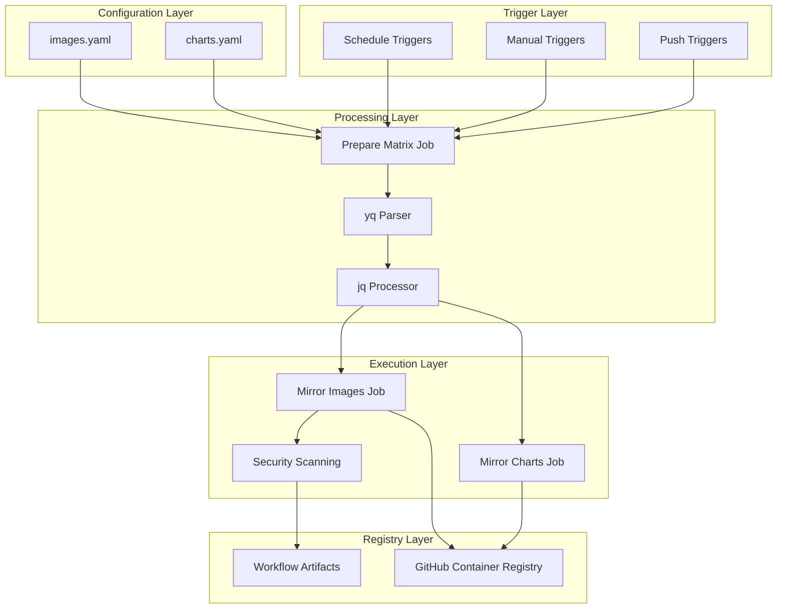

# Artefact Mirror: Technical Documentation

## Table of Contents

1. [Architecture Overview](#architecture-overview)
2. [System Components](#system-components)
3. [Configuration Schema](#configuration-schema)
4. [Workflow Implementation](#workflow-implementation)
5. [Security Implementation](#security-implementation)
6. [Advanced Configuration](#advanced-configuration)
7. [Troubleshooting](#troubleshooting)
8. [Performance Considerations](#performance-considerations)
9. [API Reference](#api-reference)

## Architecture Overview

### High-Level Architecture

Artefact Mirror is a declarative, event-driven mirroring system built on GitHub Actions that provides automated, parallel mirroring of container images and Helm charts to GitHub Container Registry (GHCR).



### Core Design Principles

1. **Declarative Configuration**: All artifacts defined in YAML configuration files
2. **Matrix Strategy**: Parallel execution using GitHub Actions matrix strategy
3. **Fail-Safe Operations**: Individual job failures don't halt entire workflow
4. **Security-First**: Automatic vulnerability scanning with Trivy
5. **Multi-Platform Support**: Native support for multiple CPU architectures
6. **Event-Driven**: Responsive to configuration changes and scheduled execution

## System Components

### 1. Configuration Management

The system uses two primary configuration files:

#### `configs/images.yaml`
Defines container images to be mirrored with their versions and platform requirements.

#### `configs/charts.yaml`
Defines Helm charts to be mirrored with their repository information and versions.

### 2. Workflow Orchestration

Two main GitHub Actions workflows:

#### `mirror-images.yaml`
- **Purpose**: Mirrors container images
- **Trigger Sources**: Schedule, manual dispatch, configuration changes
- **Matrix Generation**: Dynamic creation of parallel jobs
- **Security Integration**: Trivy vulnerability scanning

#### `mirror-charts.yaml`
- **Purpose**: Mirrors Helm charts as OCI artifacts
- **Trigger Sources**: Schedule, manual dispatch, configuration changes
- **OCI Integration**: Pushes charts to GHCR as OCI artifacts

### 3. Security Layer

- **Vulnerability Scanning**: Trivy integration for all mirrored images
- **Non-Blocking Security**: Vulnerabilities don't prevent mirroring
- **Multi-Format Reports**: Console, JSON, and artifact outputs
- **Severity Classification**: Critical, High, and Medium vulnerability tracking

## Configuration Schema

### Container Images Schema

```yaml
images:
  - name: string                    # Image name (e.g., 'nginx', 'hashicorp/vault')
    versions: [string]              # Array of version tags
    source_registry: string         # Source registry (e.g., 'docker.io')
    platforms: [string]             # Target platforms (optional)
```

#### Field Descriptions

| Field | Type | Required | Default | Description |
|-------|------|----------|---------|-------------|
| `name` | string | Yes | - | Container image name, may include namespace |
| `versions` | array | Yes | - | List of version tags to mirror |
| `source_registry` | string | Yes | - | Source container registry URL |
| `platforms` | array | No | `["linux/amd64", "linux/arm64"]` | Target CPU architectures |

#### Example Configuration

```yaml
images:
  - name: 'nginx'
    versions: ['1.25.0', '1.25.1', 'latest']
    source_registry: 'docker.io'
    platforms: ["linux/amd64", "linux/arm64", "linux/arm/v7"]
    
  - name: 'hashicorp/vault'
    versions: ['1.19.0', '1.19.5']
    source_registry: 'docker.io'
    platforms: ["linux/amd64", "linux/arm64"]
```

### Helm Charts Schema

```yaml
charts:
  - name: string                    # Chart name
    versions: [string]              # Array of chart versions
    repo_name: string               # Repository identifier
    repo_url: string                # Repository URL
```

#### Field Descriptions

| Field | Type | Required | Description |
|-------|------|----------|-------------|
| `name` | string | Yes | Helm chart name as published in repository |
| `versions` | array | Yes | List of chart versions to mirror |
| `repo_name` | string | Yes | Repository identifier for Helm commands |
| `repo_url` | string | Yes | Public Helm repository URL |

#### Example Configuration

```yaml
charts:
  - name: 'prometheus'
    versions: ['15.5.0', '15.6.0']
    repo_name: 'prometheus-community'
    repo_url: 'https://prometheus-community.github.io/helm-charts'
    
  - name: 'vault'
    versions: ['0.29.0', '0.30.0']
    repo_name: 'hashicorp'
    repo_url: 'https://helm.releases.hashicorp.com'
```

## Workflow Implementation

### Matrix Generation Process

The system uses a sophisticated matrix generation process to create parallel execution jobs:

#### 1. Configuration Parsing
```bash
# Parse YAML and generate JSON matrix
matrix=$(yq -o=json '[
  .images[]
  | . as $img
  | $img.versions[] as $v
  | {
      "name": $img.name,
      "source_registry": $img.source_registry,
      "version": $v,
      "platforms": ($img.platforms // ["linux/amd64", "linux/arm64"])
    }
]' ./configs/images.yaml | jq -c .)
```

#### 2. Matrix Structure
Each matrix entry contains:
- **name**: Image or chart name
- **version**: Specific version to mirror
- **source_registry**: Source registry URL (images only)
- **platforms**: Target platforms (images only)
- **repo_name**: Repository name (charts only)
- **repo_url**: Repository URL (charts only)

### Container Image Mirroring Process

#### 1. Authentication
```yaml
- name: Log in to GitHub Container Registry
  uses: docker/login-action@v3
  with:
    registry: ghcr.io
    username: ${{ github.actor }}
    password: ${{ secrets.GITHUB_TOKEN }}
```

#### 2. Multi-Platform Manifest Creation
```bash
# Create multi-platform manifest using Docker Buildx
docker buildx imagetools create \
  --tag ${DESTINATION_IMAGE} \
  ${SOURCE_IMAGE}
```

#### 3. Security Scanning
```yaml
- name: Scan image for vulnerabilities
  uses: aquasecurity/trivy-action@master
  with:
    image-ref: ${{ steps.image_names.outputs.destination_image }}
    format: 'table'
    exit-code: '0'
    ignore-unfixed: true
    vuln-type: 'os,library'
    severity: 'CRITICAL,HIGH,MEDIUM'
```

### Helm Chart Mirroring Process

#### 1. Repository Management
```bash
# Add upstream repository
helm repo add ${REPO_NAME} ${REPO_URL}
helm repo update
```

#### 2. Chart Processing
```bash
# Pull and push as OCI artifact
helm pull ${REPO_NAME}/${CHART_NAME} --version ${CHART_VERSION}
helm push ${CHART_NAME}-${CHART_VERSION}.tgz oci://ghcr.io/scalevector-io/${REPO_NAME}
```

## Security Implementation

### Vulnerability Scanning Architecture

#### 1. Scanning Engine
- **Tool**: Aqua Security Trivy
- **Scope**: OS packages and application libraries
- **Severities**: Critical, High, Medium
- **Approach**: Non-blocking (exit-code: 0)

#### 2. Report Generation
```bash
# Generate multiple report formats
trivy image --format table <image>     # Console output
trivy image --format json <image>      # Machine-readable
```

#### 3. Vulnerability Metrics
```bash
# Count vulnerabilities by severity
CRITICAL_COUNT=$(jq '[.Results[]?.Vulnerabilities[]? | select(.Severity == "CRITICAL")] | length' trivy-report.json)
HIGH_COUNT=$(jq '[.Results[]?.Vulnerabilities[]? | select(.Severity == "HIGH")] | length' trivy-report.json)
MEDIUM_COUNT=$(jq '[.Results[]?.Vulnerabilities[]? | select(.Severity == "MEDIUM")] | length' trivy-report.json)
```

#### 4. Alert System
```bash
# GitHub annotations for critical findings
if [ "${CRITICAL_COUNT}" -gt 0 ]; then
  echo "::warning title=Security Alert::${IMAGE_NAME} contains ${CRITICAL_COUNT} CRITICAL vulnerabilities"
fi
```

### Security Features

| Feature | Implementation | Purpose |
|---------|----------------|---------|
| Non-blocking scans | `exit-code: '0'` | Prevent scan failures from blocking mirroring |
| Multi-format reports | Table, JSON, artifacts | Support both human and automated consumption |
| Severity filtering | CRITICAL, HIGH, MEDIUM | Focus on actionable vulnerabilities |
| Unfixed filtering | `ignore-unfixed: true` | Reduce noise from unpatchable issues |
| Artifact retention | 30-day retention | Maintain scan history for compliance |

## Advanced Configuration

### Selective Mirroring

Both workflows support selective mirroring through manual dispatch inputs:

#### Container Images
```yaml
workflow_dispatch:
  inputs:
    image_name:
      description: 'Optional: Specific image to mirror (e.g., nginx). Leave blank to mirror all.'
      required: false
      default: ''
```

#### Helm Charts
```yaml
workflow_dispatch:
  inputs:
    chart_name:
      description: 'Optional: Specific chart to mirror (e.g., vault). Leave blank to mirror all.'
      required: false
      default: ''
```

### Custom Platform Support

Define custom platform combinations:

```yaml
images:
  - name: 'multiarch-app'
    versions: ['1.0.0']
    source_registry: 'docker.io'
    platforms: [
      "linux/amd64",
      "linux/arm64",
      "linux/arm/v7",
      "linux/arm/v6",
      "linux/ppc64le",
      "linux/s390x"
    ]
```

### Schedule Customization

Modify cron expressions for different scheduling:

```yaml
schedule:
  # Every day at 2:00 AM UTC
  - cron: '0 2 * * *'
  
  # Every Sunday at 1:00 AM UTC
  - cron: '0 1 * * 0'
  
  # Every 6 hours
  - cron: '0 */6 * * *'
```

## Troubleshooting

### Common Issues and Solutions

#### 1. Matrix Generation Failures

**Symptom**: Workflow fails at matrix preparation
**Causes**:
- Invalid YAML syntax
- Missing required fields
- Empty configuration arrays

**Diagnosis**:
```bash
# Test YAML syntax locally
yq eval '.images[]' configs/images.yaml
yq eval '.charts[]' configs/charts.yaml
```

**Resolution**:
- Validate YAML syntax
- Ensure all required fields are present
- Check for empty arrays

#### 2. Authentication Failures

**Symptom**: Docker login failures during mirroring
**Causes**:
- Insufficient permissions
- Token expiration
- Registry connectivity issues

**Diagnosis**:
Check workflow permissions:
```yaml
permissions:
  contents: read
  packages: write  # Required for GHCR
```

**Resolution**:
- Verify repository permissions
- Check organization package settings
- Confirm GITHUB_TOKEN scope

#### 3. Multi-Platform Build Failures

**Symptom**: Platform-specific build errors
**Causes**:
- Unsupported platform combinations
- Source image platform limitations
- Buildx configuration issues

**Diagnosis**:
```bash
# Check available platforms for source image
docker buildx imagetools inspect <source-image>
```

**Resolution**:
- Verify source image platform availability
- Adjust platform list in configuration
- Use platform-specific tags if needed

#### 4. Vulnerability Scan Timeouts

**Symptom**: Trivy scans fail or timeout
**Causes**:
- Large image sizes
- Network connectivity issues
- Database update failures

**Resolution**:
- Increase scan timeout values
- Implement retry mechanisms
- Use cached vulnerability databases

### Debugging Workflows

#### Enable Debug Logging
Add to workflow environment:
```yaml
env:
  ACTIONS_STEP_DEBUG: true
  ACTIONS_RUNNER_DEBUG: true
```

#### Matrix Inspection
```bash
# View generated matrix
echo "Generated matrix: $matrix"
echo "$matrix" | jq '.'
```

#### Image Analysis
```bash
# Inspect mirrored images
docker buildx imagetools inspect ghcr.io/scalevector-io/<image>:<tag>
```

## Performance Considerations

### Optimization Strategies

#### 1. Matrix Parallelization
- **Default**: Unlimited parallel jobs
- **Customization**: Set `max-parallel` in strategy
- **Consideration**: GitHub Actions concurrent job limits

```yaml
strategy:
  fail-fast: false
  max-parallel: 10  # Limit concurrent jobs
  matrix:
    image: ${{ fromJson(needs.prepare-matrix.outputs.matrix) }}
```

#### 2. Build Cache Optimization
```yaml
- name: Set up Docker Buildx
  uses: docker/setup-buildx-action@v3
  with:
    driver-opts: |
      image=moby/buildkit:buildx-stable-1
```

#### 3. Registry Optimization
- Use regional registry mirrors when available
- Implement registry caching strategies
- Consider registry rate limiting

### Resource Usage

| Component | Resource Type | Usage Pattern | Optimization |
|-----------|---------------|---------------|--------------|
| Matrix Generation | CPU | Burst | Efficient YAML parsing |
| Image Mirroring | Network/Storage | Sustained | Parallel execution |
| Security Scanning | CPU/Memory | Burst | Scan result caching |
| Report Generation | CPU | Burst | Efficient JSON processing |

## API Reference

### Workflow Inputs

#### Mirror Container Images

| Input | Type | Required | Default | Description |
|-------|------|----------|---------|-------------|
| `image_name` | string | No | '' | Specific image to mirror |

#### Mirror Helm Charts

| Input | Type | Required | Default | Description |
|-------|------|----------|---------|-------------|
| `chart_name` | string | No | '' | Specific chart to mirror |

### Workflow Outputs

#### Artifacts Generated

| Artifact Type | Format | Retention | Description |
|---------------|--------|-----------|-------------|
| Vulnerability Reports | Text | 30 days | Human-readable security summaries |
| Trivy JSON Reports | JSON | 30 days | Machine-readable vulnerability data |
| Workflow Logs | Text | 90 days | Detailed execution logs |

#### Registry Outputs

| Type | Location | Format | Access |
|------|----------|--------|--------|
| Container Images | `ghcr.io/scalevector-io/<name>:<tag>` | OCI | Public |
| Helm Charts | `oci://ghcr.io/scalevector-io/<repo>/<name>` | OCI | Public |

### Environment Variables

#### System Variables

| Variable | Source | Purpose |
|----------|--------|---------|
| `GITHUB_TOKEN` | GitHub Actions | Authentication |
| `GITHUB_ACTOR` | GitHub Actions | Username for registry login |
| `GITHUB_REPOSITORY` | GitHub Actions | Repository identification |

#### Custom Variables

| Variable | Scope | Usage |
|----------|-------|-------|
| `TARGET_IMAGE` | Workflow run | Selective image mirroring |
| `TARGET_CHART` | Workflow run | Selective chart mirroring |

---

## Appendix

### Version Compatibility

| Component | Version | Compatibility |
|-----------|---------|---------------|
| GitHub Actions | Latest | Required |
| Docker Buildx | 0.11+ | Multi-platform support |
| Helm | 3.12+ | OCI support |
| Trivy | Latest | Vulnerability scanning |
| yq | 4.x | YAML processing |
| jq | 1.6+ | JSON processing |

### External Dependencies

| Service | Purpose | Fallback |
|---------|---------|----------|
| GitHub Container Registry | Artifact storage | Required |
| Docker Hub | Source images | Registry-specific |
| Helm Repositories | Source charts | Repository-specific |
| Trivy Database | Vulnerability data | Cached updates |

### License and Compliance

This technical documentation is subject to the same MIT License as the project. All mirrored artifacts retain their original licenses and compliance requirements. 